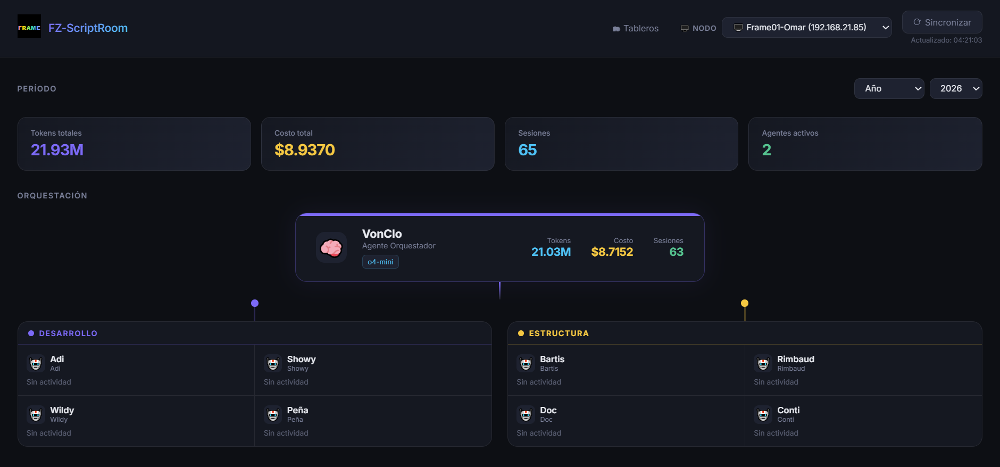
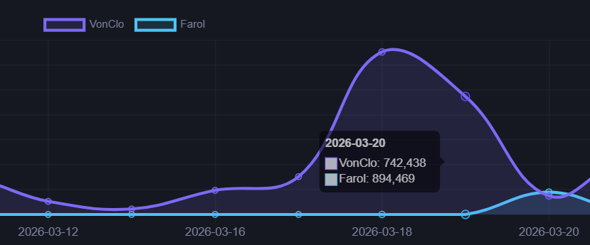
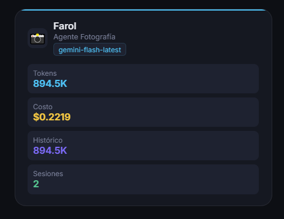
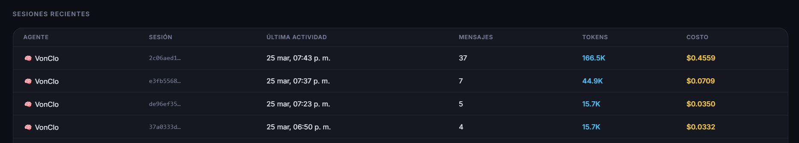

# Openclaw Dashboard

A multi-node token analytics dashboard for [Openclaw](https://openclaw.ai) autonomous agent systems. Connects to multiple remote Ubuntu machines via SSH/SFTP, ingests session data from `.jsonl` files in the background, and presents consolidated metrics, costs and project files in a dark-mode web UI.



### Vistas en Detalle
<div style="display: flex; gap: 10px;">
  
  
  
</div>

---

## Features

- **Multi-node aggregation** — monitors up to N remote Ubuntu nodes simultaneously
- **Background SSH ingestion** — syncs session data every 10 minutes without blocking the UI
- **Zero native dependencies** — uses Node.js 22 built-in `node:sqlite` (no `better-sqlite3`, no binary rebuilds)
- **Per-node filtering** — filter all metrics by a specific machine or view all nodes combined
- **Agent identity resolution** — maps technical agent IDs to display names and roles via `AGENT_ROLES`
- **Token & cost analytics** — daily/monthly timelines, per-agent breakdowns, cache token tracking
- **Project file browser** — browse and preview `.md`, `.fountain`, `.txt`, `.json` files from remote workspaces via SFTP
- **Manual sync** — "Sincronizar" button triggers an immediate SSH sync cycle on demand

---

## Architecture

```
┌─────────────────────────────────────┐
│        Openclaw Dashboard           │
│  (Node 22 + Express + node:sqlite)  │
│                                     │
│  ┌─────────────┐  ┌──────────────┐  │
│  │ ingestion   │  │   server.js  │  │
│  │ Service.js  │  │  REST API +  │  │
│  │ (bg job)    │  │  static UI   │  │
│  └──────┬──────┘  └──────────────┘  │
│         │ INSERT OR IGNORE           │
│  ┌──────▼──────────────────────┐    │
│  │  SQLite  (token_events)     │    │
│  └─────────────────────────────┘    │
└──────────┬──────────────────────────┘
           │ SSH / SFTP (ssh2)
    ┌──────┴──────┐
    │             │
┌───▼───┐   ┌────▼──┐   ┌───────┐
│ Node1 │   │ Node2 │   │ NodeN │
│Ubuntu │   │Ubuntu │   │Ubuntu │
│~/.    │   │ ~/.   │   │  ~/.  │
│openclaw   │openclaw   │openclaw
└───────┘   └───────┘   └───────┘
```

### Key design decisions

| Decision | Rationale |
|---|---|
| `node:sqlite` built-in | Eliminates native binary fragility across Node versions |
| SSH key-only auth | No passwords stored anywhere in the codebase |
| `INSERT OR IGNORE` idempotency | Safe to re-run ingestion at any time without duplicating data |
| Per-node isolated failures | If one node is offline, others continue syncing normally |
| DB model takes priority over config model | Actual recorded model from LLM responses is ground truth |

---

## Requirements

- **Node.js 22.12+** (uses `node:sqlite` stable API) — managed via [nvm](https://github.com/nvm-sh/nvm)
- **npm 10+**
- **SSH access** to each remote Ubuntu node (key-based, no password)
- Each remote node must have Openclaw installed with the standard `~/.openclaw/` directory structure

---

## Installation

### 1. Clone and install dependencies

```bash
git clone https://github.com/youruser/openclaw-dashboard.git
cd openclaw-dashboard

# Use the pinned Node version
nvm install   # reads .nvmrc (Node 22)
nvm use

npm install
```

### 2. Generate a dedicated SSH key pair

Generate a key specifically for this dashboard (don't reuse your personal key):

```bash
# On Linux/macOS:
ssh-keygen -t ed25519 -C "openclaw-dashboard" -f ~/.ssh/id_ed25519_openclaw

# On Windows (PowerShell):
ssh-keygen -t ed25519 -C "openclaw-dashboard" -f "$env:USERPROFILE\.ssh\id_ed25519_openclaw"
```

> **Leave the passphrase empty** — Node.js needs to use the key without user interaction.

### 3. Copy the public key to each remote node

```bash
# Linux/macOS:
ssh-copy-id -i ~/.ssh/id_ed25519_openclaw.pub user@NODE_IP

# Windows (PowerShell — equivalent to ssh-copy-id):
type $env:USERPROFILE\.ssh\id_ed25519_openclaw.pub | ssh user@NODE_IP `
  "mkdir -p ~/.ssh && chmod 700 ~/.ssh && cat >> ~/.ssh/authorized_keys && chmod 600 ~/.ssh/authorized_keys"
```

Verify each node connects without a password prompt:
```bash
ssh -i ~/.ssh/id_ed25519_openclaw user@NODE_IP "echo OK"
```

### 4. Configure your nodes

Copy the example config and fill in your values:

```bash
cp config/machines.example.json config/machines.json
```

Edit `config/machines.json`:

```json
[
  {
    "node_id": "mi-nodo-1",
    "label": "Nombre para mostrar",
    "host": "192.168.1.10",
    "port": 22,
    "username": "ubuntu_user",
    "privateKeyPath": "~/.ssh/id_ed25519_openclaw",
    "openclawPath": "/home/ubuntu_user/.openclaw"
  }
]
```

> `config/machines.json` is in `.gitignore` and will never be committed.

### 5. Run

```bash
# Development (auto-restarts on file changes)
npm run dev

# Production
npm start
```

Open **http://localhost:3131**

---

## Configuration reference

### `config/machines.json`

| Field | Type | Description |
|---|---|---|
| `node_id` | `string` | Unique identifier used in the database and URL params |
| `label` | `string` | Human-readable name shown in the node selector dropdown |
| `host` | `string` | IP address or hostname of the remote machine |
| `port` | `number` | SSH port (default: `22`) |
| `username` | `string` | SSH username on the remote machine |
| `privateKeyPath` | `string` | Path to the SSH private key. `~/` is resolved automatically |
| `openclawPath` | `string` | Absolute path to the `.openclaw` directory on the remote machine |

### Agent identity mapping

Agent display names and roles are defined in `src/ingestionService.js` in the `AGENT_ROLES` constant. Each entry maps a technical agent directory name to its display metadata:

```js
const AGENT_ROLES = {
  'main':                      { displayName: 'VonClo', subtitle: 'Agente Orquestador', role: 'Orquestador' },
  'agentedesarrolladordeideas':{ displayName: 'Adi',    subtitle: 'Agente Desarrollador de Ideas', ... },
  // ...
};
```

Update this map to match your Openclaw agent configuration.

---

## API Reference

| Method | Endpoint | Description |
|---|---|---|
| `GET` | `/api/nodes` | List all configured nodes (no sensitive data) |
| `GET` | `/api/stats` | Token usage stats. Query params: `node`, `tsStart`, `tsEnd`, `year`, `month` |
| `POST` | `/api/sync` | Trigger an immediate SSH ingestion cycle (non-blocking) |
| `GET` | `/api/projects` | List projects or files from a remote node. Query params: `node` (required), `project` (optional) |
| `GET` | `/api/file-content` | Preview a remote file. Query params: `node` (required), `path` (required) |

### Examples

```bash
# All nodes, current month
GET /api/stats?node=all

# Specific node, specific month
GET /api/stats?node=nodo-1&year=2026&month=3

# All time
GET /api/stats?node=all&tsStart=0&tsEnd=9999999999999

# List projects on a node
GET /api/projects?node=nodo-1

# List files in a project
GET /api/projects?node=nodo-1&project=MiProyecto

# Preview a file
GET /api/file-content?node=nodo-1&path=MiProyecto/archivo.md
```

---

## Project structure

```
openclaw-dashboard/
├── config/
│   ├── machines.json          # ← your config (gitignored)
│   └── machines.example.json  # ← safe template to commit
├── db/
│   ├── schema.sql             # SQLite schema (v2, multi-node)
│   └── openclaw-dashboard.sqlite  # ← generated DB (gitignored)
├── public/
│   ├── index.html             # Analytics dashboard
│   └── proyectos.html         # Project file browser
├── src/
│   ├── sshService.js          # SFTP wrapper (single ssh2 coupling point)
│   └── ingestionService.js    # Background sync job + identity resolver
├── server.js                  # Express app + REST API + DB bootstrap
├── package.json
├── .nvmrc                     # Node 22
└── .gitignore
```

---

## Database schema

```sql
CREATE TABLE token_events (
  id                 TEXT PRIMARY KEY,  -- nodeId::sessionId::messageId
  node_id            TEXT NOT NULL,     -- which machine generated this event
  agent_id           TEXT NOT NULL,     -- agent directory name (e.g. 'main')
  session_id         TEXT NOT NULL,
  ts                 INTEGER NOT NULL,  -- Unix ms timestamp
  model              TEXT,             -- LLM model used (from event, not config)
  input_tokens       INTEGER,
  output_tokens      INTEGER,
  cache_read_tokens  INTEGER,
  cache_write_tokens INTEGER,
  cost               REAL
);
```

Events are idempotent (`INSERT OR IGNORE`). Re-running ingestion is always safe.

---

## What gets ingested

The ingestion service reads `.jsonl` session files from each node's `~/.openclaw/agents/<agentId>/sessions/` directory. It processes:

- **Active sessions**: `<uuid>.jsonl`
- **Reset sessions**: `<uuid>.jsonl.reset.<timestamp>` — real tokens were consumed before the reset
- **Deleted sessions**: `<uuid>.jsonl.deleted.<timestamp>` — same reason

It skips `boot-*.jsonl` files (initialization events with no LLM usage).

---

## Security notes

- **No credentials are stored in the codebase.** All sensitive config lives in `config/machines.json` (gitignored).
- The `machines.json` only stores the **path** to your private key, not the key itself.
- The `/api/file-content` endpoint enforces `path.posix.normalize` to prevent directory traversal outside the workspace.
- Only `.md`, `.txt`, `.fountain`, `.json` files can be previewed — binary files are rejected.

---

## Upgrading the server to Ubuntu

When you move the dashboard from a Windows dev machine to a Linux server:

1. Install Node 22 via nvm on the server
2. Generate **new** SSH keys on the server (`ssh-keygen -t ed25519`)
3. Copy the new public key to all remote nodes (`ssh-copy-id`)
4. Update `privateKeyPath` in `machines.json` (still `~/.ssh/id_ed25519_openclaw`)
5. No code changes required — `privateKeyPath: "~/"` resolves to `os.homedir()` on any OS

---

## License

MIT
